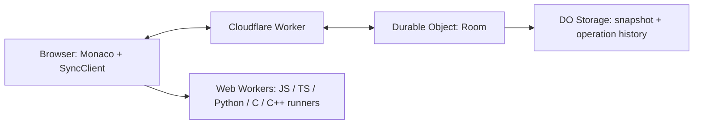

# Crustpad

Crustpad is a collaborative, runnable code scratchpad built from first principles
around a custom operational transformation engine, Monaco, and Cloudflare Durable
Objects.

It keeps Rustpad's anonymous single-document room model, then adds browser-local
code execution, state persistence, reconnect/desync handling, cursor presence,
and a Cloudflare Workers production runtime.

The app is intentionally small:

- anonymous rooms by URL
- one shared document per room
- real-time collaborative editing with shared language, presence, cursors, and
  selections
- local-only code execution in each browser tab
- no accounts, project tree, backend code execution, or hidden test harness

## What changed from `../rustpad`

Rustpad is the baseline for the product shape: a minimal collaborative editor
using a central server, WebSockets, and OT. Crustpad keeps that model but ports
the stack and adds code-running and persistence behavior.

Major changes:

- Replaced the Rust/WASM backend stack with TypeScript, Bun tooling, Vite, React,
  Monaco, and Cloudflare Workers.
- Ported the OT model into TypeScript in `src/ot.ts`, including Unicode
  codepoint-based positions at the protocol boundary.
- Added browser-local runners for JavaScript, TypeScript, Python, C, and C++.
  Output stays local to the tab that clicked Run.
- Added a persistent document snapshot model. The Bun server stores snapshots in
  SQLite through `src/database.ts`; the Cloudflare runtime stores room snapshots
  and operation history in Durable Object storage.
- Added shared language state so collaborators see the same Monaco language mode
  and download extension.
- Added user profiles, colors, cursor/selection broadcasting, dark mode, download,
  share link, output panel, and a source-loading "Read the code" action.
- Added protocol validation limits for usernames, hues, cursor counts,
  selections, and maximum document size.
- Added tests for OT behavior, room behavior, persistence, runner errors, and
  client reconnect/desync behavior.

State and connectivity fixes added on top of the Rustpad-style baseline:

- The client automatically reconnects after clean socket closes when there are no
  unacknowledged edits.
- If the socket closes while an edit is outstanding, the client enters a
  desynchronized state instead of silently retrying a possibly duplicated or lost
  edit.
- A `beforeunload` guard warns before closing a tab with an unacknowledged edit.
- Incompatible history messages are treated as desync events instead of being
  partially applied.
- Remote edits are applied outside Monaco's local undo stack, which avoids mixing
  collaborator edits into the local user's undo history.
- Presence and cursor state are cleaned up on disconnect and rebroadcast to
  remaining collaborators.
- Persisted snapshots are loaded as a synthetic insert operation so newly
  connected clients can still receive a valid initial history.
- The Cloudflare Durable Object runtime uses WebSocket hibernation APIs and
  per-socket attachments so connected sockets can be restored after object
  hibernation or version changes when the stored state is compatible.

## Development

Use Bun for dependency management and commands.

```sh
bun install
bun run dev
```

`bun run dev` builds the client once and starts `wrangler dev`, which serves the
Cloudflare Worker/Durable Object runtime locally.

For separate client/server development with Vite hot reload:

```sh
bun run dev:server
bun run dev:client
```

The Vite dev server proxies `/api` and WebSocket traffic to Wrangler on
`localhost:8787`.

Common commands:

```sh
bun run build
bun run check
bun test
bun run deploy
```

Command notes:

- `bun run build` creates the static frontend bundle in `dist/`.
- `bun run check` type-checks both the browser/server code and the Worker config.
- `bun test` runs the Bun test suite.
- `bun run deploy` builds and deploys with Wrangler.

Local Bun-server fallback:

```sh
bun run build
bun src/server.ts
```

The fallback server listens on `PORT` or `3030` and writes SQLite data to
`SQLITE_PATH` or `crustpad.sqlite`.

## Runtime Architecture

For deeper design notes, see `docs/architecture.md`.

Production is configured in `wrangler.toml`:

- `src/worker.ts` is the Cloudflare Worker entrypoint.
- Static assets are served from `dist/` through the `ASSETS` binding.
- Each room maps to one Durable Object instance through the `ROOMS` binding.
- `EXPIRY_DAYS` controls inactive room expiration.

The main request paths are:

- `/r/{roomId}`: client route handled by the single-page app.
- `/api/socket/{roomId}`: WebSocket upgrade for collaborative sync.
- `/api/text/{roomId}`: plain-text snapshot of the current room.
- `/api/stats`: runtime stats.

High-level data flow:



## Collaboration Model

`src/room.ts` owns server-side room state:

- document text
- shared language
- revision number
- accepted operation history
- user profile map
- cursor/selection map
- last access timestamp

Clients send edits with the revision they were based on. If the server has
accepted newer operations since that revision, it transforms the incoming edit
across the missing history before applying and broadcasting it.

`src/syncClient.ts` owns client-side OT state:

- `revision`: last known server revision
- `outstanding`: local edit sent but not yet acknowledged
- `buffer`: local edits made while `outstanding` is pending

When the server echoes the user's own operation, that echo is the ACK. The client
then promotes any buffered edit to `outstanding` and sends it. Remote operations
are transformed across both local pending states before being applied to Monaco.

## Why OT?

Crustpad uses a central room authority with operational transformation rather
than a peer-to-peer CRDT. That keeps the protocol compact for anonymous rooms:
clients submit edits against a server revision, the room transforms stale edits
over accepted history, and every client converges on the same ordered operation
stream.

The OT implementation in `src/ot.ts` includes:

- apply, compose, transform, and normalize operations
- base and target length accounting
- cursor/index transformation
- Unicode codepoint-aware offsets at the protocol boundary

The client follows the classic outstanding/buffer model. One local operation may
be in flight; additional local edits are composed into a buffer until the server
echoes the outstanding operation as an ACK.

## Persistence and Deploy Behavior

The Cloudflare runtime persists three values per room:

- latest document snapshot
- operation history
- last access timestamp

This is deliberate. Snapshot persistence lets rooms survive restarts; operation
history lets connected clients and hibernated WebSockets resume with compatible
revision state. If a room can only be restored from a snapshot and not operation
history, existing sockets are closed with a reconnect signal instead of being
reattached to ambiguous state.

The Bun fallback stores SQLite snapshots and uses a synthetic initial insert when
loading a saved room. That is enough for new connections, but it is not as strong
as Durable Object storage for preserving active WebSocket sessions across server
restarts.

During a Cloudflare deploy, traffic moves to the new Worker version. Durable
Objects may be reset when their version changes. Crustpad restores compatible
connections through `ctx.getWebSockets()` and serialized socket attachments, so
users should usually see at most a brief pause. If an edit was in flight and the
client cannot prove it was acknowledged, the client desynchronizes and asks for a
refresh rather than risking data corruption.

## Code Execution Design

Run events are intentionally not part of the sync protocol. Clicking Run executes
the current editor text only in that browser tab.

Runner behavior:

- JavaScript runs inside a dedicated Web Worker.
- TypeScript is transpiled with `esbuild-wasm`, then run with the JavaScript
  runner model.
- Python runs in a worker-backed Pyodide environment.
- C and C++ run in browser workers using bundled browser runtimes.
- Workers capture stdout, stderr, thrown errors, duration, timeouts, and output
  truncation.
- Python keeps a warm worker between runs unless it times out or fails hard; the
  other runners are terminated after each run.

Code runs locally in browser workers with network-like host APIs disabled where
the browser allows it, restrictive worker CSP headers, execution timeouts, setup
timeouts, and output limits. This is intended for lightweight snippets, not
adversarial sandboxing.

Runner workers have restrictive Content Security Policy headers generated by
`vite.config.ts` for both Cloudflare assets and the Bun fallback server.

## Design Decisions

- Prefer a central room authority over peer-to-peer sync. It keeps OT ordering,
  presence, persistence, and reconnect semantics simpler.
- Keep rooms anonymous and URL-addressable. There is no account system or access
  control layer in this repository.
- Keep execution local. The backend never runs user code, which simplifies
  hosting and keeps collaborator output private by default.
- Persist snapshots for durability, but keep live operation history for active
  collaboration correctness.
- Treat unknown sync state as desynchronized. Losing an edit is worse than asking
  a user to refresh.
- Use Cloudflare Durable Objects in production because a room naturally maps to a
  single stateful coordinator with WebSocket support.
- Keep the Bun server as a self-host/local fallback, not the primary production
  deployment target.

## Limitations

- Rooms are anonymous and URL-addressable; there is no auth or private room
  access control.
- Documents are not end-to-end encrypted.
- The local code runner is a practical browser-worker sandbox for trusted
  snippets, not a formal adversarial security boundary.
- Cloudflare room storage expires after one inactive day by default.
- Operation history is persisted per room until expiry; there is no history
  compaction yet.

## Future Work

- Add broader property-based OT tests for generated concurrent edits and cursor
  edge cases.
- Compact operation history by periodically snapshotting document state and
  discarding operations no connected client still needs.
- Improve runner isolation for less-trusted code.
- Explore collaborative undo on top of the OT history model.

## Configuration

Cloudflare variables are configured in `wrangler.toml`:

- `EXPIRY_DAYS`: number of inactive days before room storage is eligible for
  cleanup. Defaults to `1`.

Bun fallback environment variables:

- `PORT`: HTTP port. Defaults to `3030`.
- `SQLITE_PATH`: SQLite file path. Defaults to `crustpad.sqlite`.
- `EXPIRY_DAYS`: inactive room/document expiration window. Defaults to `1`.

## Repository Map

- `src/App.tsx`: top-level React application shell.
- `src/Sidebar.tsx`: controls for connection status, language, run, download,
  sharing, users, and profile editing.
- `src/OutputPanel.tsx`: local runner result display.
- `src/useSyncSession.ts`: React bridge between Monaco and `SyncClient`.
- `src/syncClient.ts`: client-side WebSocket, reconnect, desync, and OT state.
- `src/room.ts`: server-side room state and protocol handling.
- `src/worker.ts`: Cloudflare Worker and Durable Object runtime.
- `src/server.ts`: Bun server fallback.
- `src/database.ts`: SQLite snapshot store for the Bun fallback.
- `src/ot.ts`: TypeScript OT implementation.
- `src/protocol.ts`: shared message and language types.
- `src/runner/`: language-specific browser execution workers.
- `tests/`: Bun tests for OT, rooms, persistence, runners, and sync client logic.

## License

Crustpad is licensed under the MIT license. See `LICENSE`.
